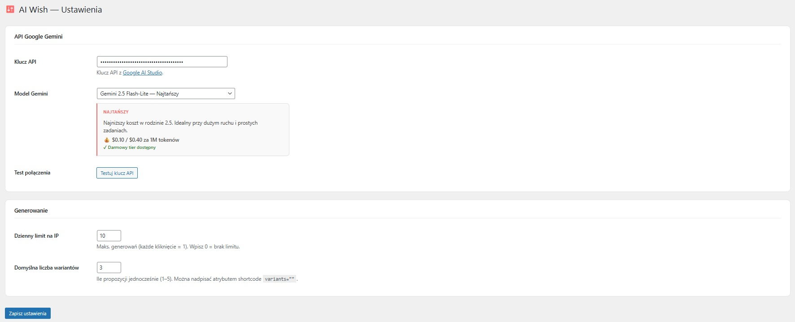

# AI Wish Generator

WordPress plugin generating personalized wishes using Google Gemini AI. Available as a shortcode and a Gutenberg block.

## Features

- **Multiple variants** — generate 1–5 wish variants in a single request
- **Occasions** — birthday, baptism, first birthday, communion, wedding, anniversary, Christmas, Easter, New Year, and more
- **Tone control** — sentimental, wise, funny, short & modern, official, poetic
- **Length control** — short (2 sentences), standard (3–5), extended (6–8), poem
- **Rhyme mode** — toggle for rhymed wishes or poems with AABB/ABAB scheme
- **Surprise me** — randomizes occasion, tone and length, then auto-generates
- **AI improve** — paste any wish and improve it: shorten, add rhyme, add emotion, make formal
- **Card export** — download wishes as JPG or PDF with 5 card templates
- **Share** — Facebook and WhatsApp share buttons
- **Editable cards** — click any generated wish to edit it inline, with word/character counter
- **History & stats** — admin panel with generation history and per-occasion statistics
- **Rate limiting** — configurable daily limit per IP address
- **Cache** — 24h transient cache for identical requests

## Screenshots

### Admin Settings — model selection with pricing info


Choose from all available Gemini models. Each model displays a description, price per 1M tokens and free tier availability.

---

<!-- Add more screenshots below as you collect them:

### Frontend — wish generator form


### Generated wish cards


### Gutenberg block in editor


### Admin Dashboard — statistics


-->

## Requirements

- WordPress 6.0+
- PHP 7.4+
- Google Gemini API key ([get one here](https://aistudio.google.com/app/apikey))

## Installation

1. Download the plugin zip
2. Go to **WordPress Admin → Plugins → Add New → Upload Plugin**
3. Activate the plugin
4. Go to **AI Wish → Settings** and enter your Gemini API key

## Usage

### Shortcode

```
[ai_wish_generator]
```

Optional attributes:

| Attribute | Description | Example |
|-----------|-------------|---------|
| `occasions` | Comma-separated occasion keys to show | `urodziny,slub,komunia` |
| `tones` | Comma-separated tone keys to show | `wzruszajacy,smieszny` |
| `variants` | Number of variants to generate (1–5) | `3` |

**Available occasion keys:** `urodziny`, `chrzest`, `roczek`, `narodziny`, `komunia`, `imieniny`, `slub`, `rocznica`, `wielkanoc`, `boze_narodzenie`, `awans`, `nowy_rok`

**Available tone keys:** `wzruszajacy`, `madry`, `smieszny`, `krotki`, `oficjalny`, `poetycki`

### Gutenberg Block

Search for **"AI Generator Życzeń"** in the block inserter. Configure variants, occasions and tones in the block sidebar.

## Admin Panel

Navigate to **AI Wish** in the WordPress admin menu:

- **Dashboard** — total generations, today's count, top occasions chart
- **Settings** — API key, Gemini model, daily limit per IP, default variants
- **History** — paginated log of all generated wishes with sender/recipient/occasion

## Configuration

| Option | Default | Description |
|--------|---------|-------------|
| API Key | — | Google Gemini API key (required) |
| Model | `gemini-2.5-flash` | Gemini model to use |
| Daily limit | `20` | Max generations per IP per day (0 = unlimited) |
| Default variants | `3` | Default number of variants |

## Available Models

| Model | Best for | Price (input / output per 1M tokens) |
|-------|----------|--------------------------------------|
| Gemini 2.5 Flash | **Recommended** — best value | $0.30 / $2.50 |
| Gemini 2.5 Flash-Lite | Cheapest — high traffic | $0.10 / $0.40 |
| Gemini 2.5 Pro | Highest quality | $1.25 / $10.00 |
| Gemini 3 Flash Preview | New generation | $0.50 / $3.00 |
| Gemini 3.1 Flash-Lite Preview | New gen · budget | $0.25 / $1.50 |
| Gemini 3.1 Pro Preview | Most powerful | $2.00 / $12.00 |

## License

GPL-2.0-or-later
